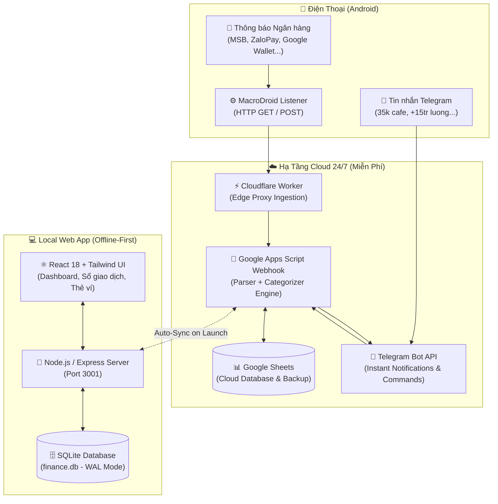

# 💎 Salarini — AI-Powered Personal Finance & Expense Tracker

> **Hệ sinh thái quản lý tài chính cá nhân tự động hóa toàn diện 2026**: Tự động bắt thông báo biến động số dư ngân hàng (MSB, ZaloPay, Google Wallet, VCB...) ➜ Ghi chép 0.1s qua Telegram Bot & Cloudflare Worker ➜ Đồng bộ hai chiều với Google Sheets ➜ Trực quan hóa trên Web App chuẩn Fintech 2026.

---

## 🌟 Tính Năng Nổi Bật (Key Features)

### 1. 🤖 Tự Động Hóa Telegram Bot & Bắt Thông Báo Ngân Hàng
- **Zero-Friction Fast Logging**: Ghi chép thu chi siêu nhanh bằng ngôn ngữ tự nhiên (`35k cafe`, `-45k cơm trưa`, `+15tr lương cty`).
- **Real-Time Bank Notification Auto-Capture**: Tự động bắt biến động số dư từ điện thoại qua MacroDroid (*MSB DigiBank, ZaloPay, Google Wallet, HSBC, Vietcombank, Techcombank, VPBank, TPBank, Momo...*).
- **Trích xuất thông minh (Smart Parser)**: Tự động tách số tiền, loại bỏ số dư thừa, trích xuất chuẩn xác tên giao dịch và địa điểm chi tiêu.
- **Dạy từ khóa tức thì (Instant Keyword Teaching)**: Nhắn `cà phê = Ăn uống` hoặc `netflix = Giải trí` để Bot tự động học và ghi nhớ vĩnh viễn.
- **Hoàn tác 1 chạm (Instant Undo)**: Nhắn `/xoa` hoặc `/undo` để xóa ngay giao dịch vừa ghi nhầm.
- **Cảnh báo chi tiêu thông minh**: Tự động phát hiện khi tổng chi vượt ngưỡng ngân sách và nhắc nhở kịp thời.

### 2. 📊 Bảng Điều Khiển Tài Chính Fintech 2026 (Modern Dashboard)
- **Financial Health Score Gauge (0 - 100)**: Vòng đo sức khỏe tài chính tính toán theo thời gian thực dựa trên tỷ lệ tích lũy và cấu trúc chi tiêu.
- **Daily Burn Rate & Month-End Projection**: Đo lường tốc độ "đốt tiền" trung bình mỗi ngày và dự báo tổng chi tiêu cuối tháng.
- **Safe Daily Spending**: Hạn mức chi tiêu an toàn còn lại mỗi ngày để đảm bảo hoàn thành mục tiêu tiết kiệm ≥ 20%.
- **Biểu đồ cột tương tác (Interactive Daily Spending)**: Tự động đổi màu theo mức độ chi (Xanh = Dưới TB, Cam = Vượt TB, Đỏ = Đột biến), bấm vào cột để xem chi tiết từng ngày.
- **Đo lường Quy tắc 50/30/20**: Theo dõi sát sao 3 trụ cột: *50% Thiết yếu (Needs)*, *30% Linh hoạt (Wants)*, *20% Tích lũy (Savings)*.

### 3. 💳 Quản Lý Ví Thông Minh (Digital Smart Cards)
- Giao diện thẻ chip kỹ thuật số hiện đại cho từng loại ví: Tiền mặt, Tài khoản Ngân hàng, Ví điện tử, Thẻ tín dụng.
- **Chuyển tiền nội bộ (Internal Transfer)**: Điều chuyển số dư giữa các ví chỉ với 1 click.

### 4. 🎨 Bộ Sưu Tập 5 Theme Modern 2026
- 🌌 **Midnight Cyber (Mặc định)**: Nền Slate đen bóng, viền xanh ngọc Emerald & Cyan công nghệ.
- 🔮 **Neon Tokyo (Cyberpunk)**: Nền tím thẫm OLED, dạ quang Electric Violet & Cyber Pink tương lai.
- 🌲 **Nordic Forest**: Nền rêu thông Bắc Âu, kính mờ Sage Glass dịu mắt và thư thái.
- 🌊 **Oceanic Sapphire**: Nền xanh biển sâu Cobalt, viền xanh băng Ice Cyan phong cách Fintech.
- ☕ **Espresso Gold**: Nền Mocha trầm ấm, điểm xuyết ánh vàng kim Champagne Gold sang trọng.
- *Nút chọn Theme tích hợp gọn gàng ở chân Sidebar, chuyển đổi tức thì và tự động lưu trên trình duyệt.*

### 5. 🧠 Cố Vấn Tài Chính AI & Phân Tích Hiệu Ứng Latte
- Tự động thống kê các khoản chi nhỏ lẻ (`≤ 60.000₫`) tích tụ hàng tháng gây thất thoát dòng tiền (Hiệu ứng Latte).
- Đưa ra khuyến nghị tối ưu hóa ngân sách và giảm thiểu chi phí phát sinh.

---

## 🏗️ Kiến Trúc Hệ Thống (System Architecture)



---

## 📂 Cấu Trúc Thư Mục (Project Structure)

```text
Salarini/
├── backend/                  # Node.js + Express + TypeScript API Server
│   └── src/
│       ├── advisor/          # AI Financial Health & Latte Factor Engine
│       ├── parser/           # Telegram text parser & regex engines
│       ├── routes/           # REST API routes (transactions, accounts, analytics...)
│       ├── services/         # Telegram & Google Sheets sync services
│       ├── db.ts             # SQLite initialization & WAL mode setup
│       └── index.ts          # Server entrypoint
├── frontend/                 # React 18 + Vite + Tailwind CSS Frontend
│   └── src/
│       ├── api/              # Typed API Client
│       ├── components/       # UI Components (Sidebar, Navbar, ThemeSelector...)
│       ├── context/          # ThemeContext (5 Modern 2026 Themes)
│       ├── pages/            # Dashboard, Transactions, Accounts, Categories, Compare...
│       ├── types/            # TypeScript data interfaces
│       └── index.css         # Tailwind directives & 2026 Theme Stylesheets
├── cloud/                    # Mã nguồn triển khai Google Apps Script
│   ├── google_apps_script.js # Core Apps Script (Parser, Webhook, Sheet DB)
│   └── appsscript.json       # Manifest cấu hình Apps Script
├── worker/                   # Cloudflare Edge Worker
│   └── cloudflare_worker.js  # Edge Proxy Worker cho MacroDroid & Telegram
├── data/                     # Thư mục lưu trữ SQLite cục bộ (chặn commit qua .gitignore)
│   └── finance.db            # Cơ sở dữ liệu SQLite
├── google_sheet_export/      # File xuất mẫu Google Sheets & sao lưu
├── start.sh                  # Script khởi động tự động trong 1 click
├── package.json              # Project configuration & dependencies
├── tsconfig.json             # Root TypeScript configuration
├── .env.example              # Cấu hình biến môi trường mẫu
├── .clasp.json.example       # Cấu hình Google Clasp mẫu
├── LICENSE                   # Giấy phép bản quyền GNU General Public License v3.0
└── README.md                 # Tài liệu hướng dẫn sử dụng toàn diện
```

---

## 🚀 Hướng Dẫn Cài Đặt Nhanh Trong 60 Giây (Quickstart)

### 1. Yêu Cầu Hệ Thống
- **Node.js**: Phiên bản 18 trở lên (`node -v`).
- **NPM**: Đi kèm với Node.js.

### 2. Cài Đặt & Khởi Động
Mở Terminal tại thư mục `Salarini`:

```bash
# Cấp quyền thực thi và khởi động toàn bộ ứng dụng
chmod +x start.sh
./start.sh
```

Mở trình duyệt và truy cập: **[http://localhost:3001](http://localhost:3001)**

---

## ⚙️ Hướng Dẫn Thiết Lập Tự Động Hóa Cloud & Điện Thoại

### Bước 1: Thiết Lập Google Sheet & Google Apps Script
1. Tạo 1 file **Google Sheet** mới trên Google Drive của bạn.
2. Trên Google Sheet, vào **Tiện ích mở rộng ➜ Apps Script**.
3. Copy toàn bộ nội dung trong file [`cloud/google_apps_script.js`](cloud/google_apps_script.js) và dán đè vào trình soạn thảo.
4. Cấu hình thông tin xác thực (khuyến nghị vào **Cài đặt dự án ➜ Thuộc tính tập lệnh / Script Properties** hoặc sửa các biến đầu file):
   - `BOT_TOKEN`: Token bot Telegram của bạn từ `@BotFather`.
   - `SECRET_TOKEN`: Mã bảo mật xác thực bất kỳ (vd: `your_secret_token_here`).
   - `ALLOWED_CHAT_ID`: ID chat Telegram của bạn.
   - `WORKER_URL`: Đường dẫn Cloudflare Worker của bạn (dạng `https://ten-worker.workers.dev`).
5. Chọn hàm `setupSheet` ➜ Bấm **Chạy (Run)** để tạo tự động các tab `Transactions`, `Categories`, `Accounts`.
6. Bấm **Triển khai (Deploy) ➜ Bản triển khai mới**:
   - Loại: **Ứng dụng web (Web App)**.
   - Thực thi dưới dạng: **Tôi (Me)**.
   - Ai có quyền truy cập: **Bất kỳ ai (Anyone)**.
   - Copy đường dẫn Web App URL nhận được (có đuôi `/exec`).

### Bước 2: Thiết Lập Cloudflare Worker (Miễn Phí)
1. Đăng nhập [Cloudflare Dashboard](https://dash.cloudflare.com/) ➜ Vào **Workers & Pages ➜ Create Application ➜ Create Worker**.
2. Copy toàn bộ nội dung file [`worker/cloudflare_worker.js`](worker/cloudflare_worker.js) và dán đè vào code Worker.
3. Cài đặt các biến môi trường trong mục **Settings ➜ Variables** (hoặc sửa trực tiếp):
   - `GOOGLE_SCRIPT_URL`: Link Web App `/exec` vừa tạo ở Bước 1.
   - `SECRET_TOKEN`: Khớp với mã bảo mật ở Bước 1.
   - `ALLOWED_CHAT_ID`: ID chat Telegram của bạn.
4. Bấm **Deploy**. Bạn sẽ có link Worker dạng `https://ten-worker.workers.dev`.

### Bước 3: Thiết Lập MacroDroid Trên Android (Bắt thông báo ngân hàng)
1. Cài đặt ứng dụng **MacroDroid** từ Google Play Store và cấp quyền đọc thông báo (*Notification Access*).
2. Tạo 1 **Macro mới**:
   - **🔴 Trigger (Kích hoạt)**:
     - Chọn **Thông báo đã nhận (Notification Received)**.
     - Chọn các app ngân hàng của bạn (*MSB DigiBank, ZaloPay, Google Wallet, VCB...*).
     - Mục Nội dung: Chọn **Bất kỳ nội dung nào (Any content)**.
   - **🔵 Action (Hành động)**:
     - Chọn **Yêu cầu HTTP (HTTP Request)**.
     - **Phương thức**: `GET`.
     - **URL**:
       ```text
       https://ten-worker.workers.dev/?text=[notification_title] [notification_text]
       ```
       *(Dùng nút `...` để chọn Magic Text `Notification title` và `Notification text`)*.
3. Bật công tắc Macro sang **ON**. Từ nay, mỗi khi có thông báo trừ tiền/cộng tiền, điện thoại sẽ tự động ghi sổ và báo về Telegram ngay tức khắc!

---

## 💬 Cú Pháp Nhắn Tin Telegram Nhanh

| Mục đích | Cú pháp ví dụ | Kết quả nhận diện |
|---|---|---|
| **Chi tiêu cơ bản** | `35k cafe` hoặc `45k com trua` | Tự gán `-35.000₫` vào `[An uong]` |
| **Ghi nhiều khoản cùng lúc** | `35k cafe`<br/>`120k xang`<br/>`50k banh` | Tự động tách và lưu 3 giao dịch riêng biệt |
| **Thu nhập** | `+15tr luong cty` hoặc `500k thuong` | Tự gán `+15.000.000₫` vào `[Luong chinh]` |
| **Sửa ghi chú vừa nhập** | `cơm sườn trứng` | Tự cập nhật ghi chú giao dịch gần nhất |
| **Dạy từ khóa mới** | `cà phê = Ăn uống` | Lưu từ khóa `cà phê` vào danh mục `Ăn uống` |
| **Xóa / Hoàn tác** | `/xoa` hoặc `/undo` | Xóa ngay giao dịch vừa ghi nhầm |
| **Trợ giúp & Hướng dẫn** | `/start` hoặc `/help` | Hiển thị bảng hướng dẫn sử dụng nhanh |

---

## 🛠️ Công Nghệ Sử Dụng (Tech Stack)

- **Frontend**: React 18, Vite, TypeScript, Tailwind CSS, Lucide React, Recharts.
- **Backend**: Node.js, Express, TypeScript, Better-SQLite3 (`WAL Mode`).
- **AI Engine**: Google Gemini API (`@google/genai` - `gemini-3.6-flash`) + Offline Rule-based Heuristic Engine.
- **Cloud & Edge**: Cloudflare Workers, Google Apps Script, Google Sheets API.
- **Mobile Automation**: MacroDroid (Android Notification Listener & Webhook Dispatcher).
- **Communication**: Telegram Bot API.

---

## 🤖 Tuyên Bố Sử Dụng AI (AI & LLM Disclosure)

Dự án **Salarini** được xây dựng với sự minh bạch tuyệt đối về việc ứng dụng Trí Tuệ Nhân Tạo (AI):

### 1. Đồng Hành Phát Triển (AI-Assisted Engineering)
- Kiến trúc giải pháp, logic bóc tách thông báo tự động (Parser engine), và các thành phần giao diện người dùng được thiết kế, tối ưu mã nguồn với sự đồng hành của các mô hình AI tiên tiến (**Google DeepMind Antigravity** & **Gemini models**).

### 2. Cố Vấn Tài Chính Cá Nhân AI Thời Gian Thực (Runtime AI Advisor)
- Hệ thống tích hợp trực tiếp mô hình **Google Gemini AI** (`gemini-3.6-flash`) thông qua SDK chính thức `@google/genai` để phân tích số liệu tài chính tháng, dự báo xu hướng chi tiêu và phân tích **Hiệu ứng Latte** (các khoản chi nhỏ lắt nhắt gây rò rỉ dòng tiền).
- **Bảo vệ nhiều lớp (Production Anti-Abuse Protection)**: Tích hợp bộ đệm In-Memory TTL Cache (1 giờ), Giới hạn tần suất trượt (Sliding Window Rate Limiter 10 RPM), và **Bộ máy suy luận ngoại tuyến (Offline Rule-Based Fallback Engine)** giúp bảo vệ hạn ngạch API và đảm bảo ứng dụng luôn phản hồi chính xác 100% ngay cả khi offline.

---

## 📄 Bản Quyền & Giấy Phép (License)

Dự án được phát hành dưới giấy phép mã nguồn mở Copyleft **[GNU General Public License v3.0 (GPLv3)](LICENSE)**.

> **Quyền tự do Copyleft**: Bạn được toàn quyền sử dụng, nghiên cứu, chia sẻ và sửa đổi mã nguồn. Mọi tác phẩm phái sinh hoặc bản phân phối lại đều bắt buộc phải được công khai mã nguồn và phát hành dưới cùng giấy phép GNU GPLv3.
