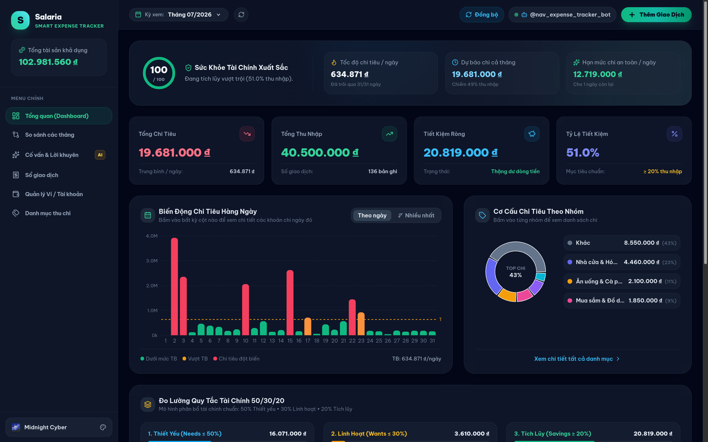
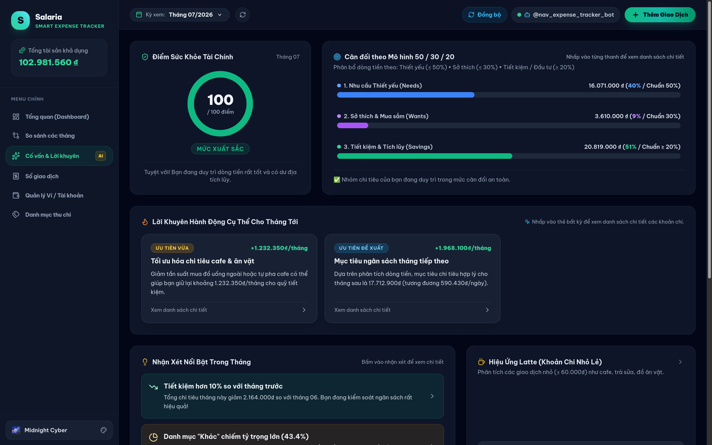
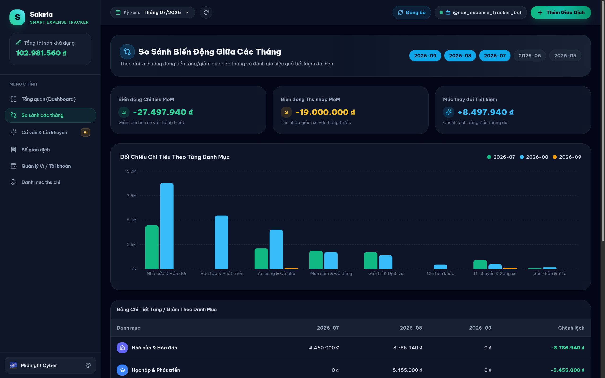
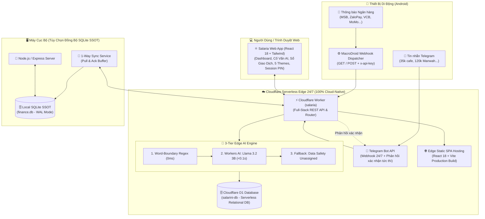

# 💎 Salaria — Serverless Cloud-Native AI Personal Finance & Expense Tracker

> **Hệ sinh thái quản lý tài chính cá nhân tự động hóa toàn diện 2026**: Tự động bắt thông báo biến động số dư ngân hàng (*MSB, ZaloPay, Google Wallet, VCB, MoMo, Techcombank...*) ➜ Bóc tách & phân loại thông minh qua **Cloudflare Workers AI (Llama 3.2 3B)** trong 0.1s ➜ Lưu trữ trên **Cloudflare D1 Database** ➜ Trực quan hóa trên **Modern Fintech Dashboard** chuẩn 2026 với 5 giao diện đổi màu & Cố vấn Tài chính AI.

<p align="center">
  
</p>

---

## 🌟 Tính Năng Nổi Bật (Key Features)

### 1. 🤖 Tự Động Hóa Telegram Bot & Bắt Biến Động Số Dư Ngân Hàng 24/7
- **Zero-Friction Fast Logging**: Ghi chép thu chi siêu tốc bằng ngôn ngữ tự nhiên (`35k cafe`, `-45k cơm trưa`, `+15tr lương cty`).
- **Real-Time Bank Notification Auto-Capture**: Bắt biến động số dư tức thì qua MacroDroid trên Android (*MSB DigiBank, ZaloPay, Google Wallet, HSBC, Vietcombank, Techcombank, VPBank, TPBank, MoMo...*).
- **Phân loại AI Đa tầng (3-Tier Engine)**:
  - **Tầng 1 (0ms Regex)**: Khớp từ khóa từ bảng `categories` trên D1 Database với cơ chế **Word-Boundary** chống va chạm từ con.
  - **Tầng 2 (Cloudflare Workers AI)**: Tự động gọi **Llama 3.2 3B** trên mạng GPU Edge để hiểu ngữ cảnh, thương hiệu quán ăn, bóc tách tên món và gán danh mục chính xác (< 0.2s).
  - **Tầng 3 (Data Safety Fallback)**: Tự động giữ trạng thái `Chưa phân loại` (`category_id = NULL`) với các giao dịch mơ hồ hoặc chuyển khoản không rõ nội dung.
- **Hoàn tác & Phản hồi tức thì**: Bot phản hồi xác nhận phân loại ngay trên Telegram chỉ sau ~0.2 giây. Hỗ trợ hoàn tác nhanh bằng lệnh `/undo` hoặc `/xoa`.

### 2. 📊 Bảng Điều Khiển Tài Chính Fintech 2026 (Modern Dashboard)
- **Financial Health Score Gauge (0 - 100)**: Vòng đo sức khỏe tài chính tính toán theo thời gian thực dựa trên tỷ lệ tích lũy và cấu trúc chi tiêu.
- **Daily Burn Rate & Month-End Projection**: Đo lường tốc độ "đốt tiền" trung bình mỗi ngày và dự báo tổng chi tiêu cuối tháng.
- **Safe Daily Spending**: Hạn mức chi tiêu an toàn còn lại mỗi ngày để đảm bảo hoàn thành mục tiêu tiết kiệm ≥ 20%.
- **Biểu đồ cột tương tác (Interactive Daily Spending)**: Tự động đổi màu theo mức độ chi (Xanh = Dưới TB, Cam = Vượt TB, Đỏ = Đột biến), bấm vào cột để xem chi tiết từng ngày.
- **Đo lường Quy tắc 50/30/20**: Theo dõi sát sao 3 trụ cột: *50% Thiết yếu (Needs)*, *30% Linh hoạt (Wants)*, *20% Tích lũy (Savings)*.

### 3. 🧠 Cố Vấn Tài Chính AI & Phân Tích Hiệu Ứng Latte (AI Advisor)
- Tự động thống kê các khoản chi nhỏ lẻ (`≤ 60.000₫`) tích tụ hàng tháng gây thất thoát dòng tiền (Hiệu ứng Latte).
- Cố vấn AI thông minh hỗ trợ giải đáp chiến lược tối ưu ngân sách, tính toán tiềm năng tiết kiệm và phân bổ dòng tiền tháng tới qua **Cloudflare Workers AI (Llama 3.2)**.

<p align="center">
  
</p>

### 4. 📈 So Sánh Biến Động Đa Tháng (Multi-Month Analytics)
- Theo dõi xu hướng tăng giảm thu chi và dòng tiền thặng dư giữa các tháng (MoM - Month over Month).
- Biểu đồ đối chiếu chi tiết từng nhóm danh mục theo thời gian thực.

<p align="center">
  
</p>

### 5. 🎨 Bộ Sưu Tập 5 Theme Modern 2026 & Bảo Mật PIN
- 🌌 **Midnight Cyber (Mặc định)**: Nền Slate đen bóng, viền xanh ngọc Emerald & Cyan công nghệ.
- 🔮 **Neon Tokyo (Cyberpunk)**: Nền tím thẫm OLED, dạ quang Electric Violet & Cyber Pink tương lai.
- 🌲 **Nordic Forest**: Nền rêu thông Bắc Âu, kính mờ Sage Glass dịu mắt và thư thái.
- 🌊 **Oceanic Sapphire**: Nền xanh biển sâu Cobalt, viền xanh băng Ice Cyan phong cách Fintech.
- ☕ **Espresso Gold**: Nền Mocha trầm ấm, điểm xuyết ánh vàng kim Champagne Gold sang trọng.
- 🔒 **Khóa Bảo Mật Session PIN**: Tự động khóa bảo vệ dữ liệu khi đóng tab trình duyệt; hỗ trợ tùy biến mã PIN quản trị viên linh hoạt.

---

## 🏗️ Kiến Trúc Hệ Thống (System Architecture)



### 🔒 Luồng Xử Lý & Bảo Mật:
1. **Cloudflare D1 (Serverless Relational Database)**: Lưu trữ toàn bộ danh mục, tài khoản, số dư và giao dịch với độ trễ cực thấp trên mạng lưới Cloudflare toàn cầu.
2. **Workers AI (Llama 3.2 3B)**: Xử lý ngôn ngữ tự nhiên và phân tích tài chính thông minh trực tiếp trên GPU Edge của Cloudflare, không cần phụ thuộc vào API key bên thứ ba.
3. **Session PIN Authentication**: Cơ chế xác thực mã PIN theo phiên làm việc giúp ngăn ngừa việc truy cập trái phép trên các thiết bị chia sẻ.

---

## 📂 Cấu Trúc Thư Mục (Project Structure)

```text
Salaria/
├── frontend/                 # React 18 + Vite + Tailwind CSS Frontend
│   └── src/
│       ├── api/              # Typed API Client (Cloudflare REST API)
│       ├── components/       # UI Components (Sidebar, Navbar, ThemeSelector, PinLockScreen...)
│       ├── context/          # ThemeContext (5 Modern 2026 Themes)
│       ├── pages/            # Dashboard, Transactions, Accounts, Categories, Advisor, Compare...
│       ├── types/            # TypeScript data interfaces
│       └── index.css         # Tailwind directives & Theme Stylesheets
├── worker/                   # Cloudflare Edge Worker & D1 Database
│   ├── cloudflare_worker.js  # Full-Stack Edge REST API & Workers AI Llama-3.2 Engine
│   ├── schema.sql            # Schema D1 Database & Seed Categories
│   └── wrangler.jsonc        # Cấu hình Wrangler (D1 Database & Workers AI Binding)
├── backend/                  # Node.js + Express Server (Tùy chọn Local Desktop)
│   └── src/
│       ├── advisor/          # Smart Advisor & Financial Analytics Engine
│       ├── parser/           # Telegram text parser & regex engines
│       ├── routes/           # REST API routes (transactions, accounts, analytics...)
│       ├── services/         # D1 Sync Service (Pull & Ack) & Telegram Sync
│       ├── db.ts             # SQLite initialization & WAL mode setup
│       └── index.ts          # Local Server entrypoint
├── docs/                     # Tài liệu & hình ảnh minh họa showcase
├── start.sh                  # Script khởi động tự động ứng dụng trong 1 click
├── package.json              # Root project dependencies & scripts
├── tsconfig.json             # Root TypeScript configuration
├── .env.example              # Cấu hình biến môi trường mẫu
├── LICENSE                   # Giấy phép GNU General Public License v3.0
└── README.md                 # Tài liệu hướng dẫn sử dụng toàn diện
```

---

## 🚀 Hướng Dẫn Cài Đặt Nhanh (Quickstart)

### 1. Yêu Cầu Hệ Thống
- **Node.js**: Phiên bản 18 trở lên (`node -v`).
- **NPM**: Đi kèm với Node.js.

### 2. Khởi Động Phát Triển Cục Bộ
Mở Terminal tại thư mục `Salaria`:

```bash
# Cấp quyền thực thi và khởi động Web App
chmod +x start.sh
./start.sh
```

Mở trình duyệt và truy cập: **[http://localhost:5173](http://localhost:5173)**

---

## ⚙️ Hướng Dẫn Triển Khai Cloudflare Serverless & Telegram

### Bước 1: Triển Khai Cloudflare Edge Worker & D1 Database
1. Cài đặt và đăng nhập Wrangler CLI:
   ```bash
   cd worker
   npx wrangler login
   ```
2. Tạo cơ sở dữ liệu Cloudflare D1:
   ```bash
   npx wrangler d1 create salarini-db
   ```
3. Chạy migration tạo bảng dữ liệu mẫu:
   ```bash
   npx wrangler d1 execute salarini-db --remote --file=schema.sql
   ```
4. Lưu API Key bảo mật và Telegram Bot Token vào Cloudflare Secrets:
   ```bash
   printf 'YOUR_SECRET_API_KEY' | npx wrangler secret put API_KEY
   printf 'YOUR_TELEGRAM_BOT_TOKEN' | npx wrangler secret put TELEGRAM_BOT_TOKEN
   ```
5. Triển khai Worker lên Cloudflare Edge:
   ```bash
   npx wrangler deploy
   ```
   *Bạn sẽ nhận được URL Worker dạng `https://salaria.your-subdomain.workers.dev`.*

### Bước 2: Đăng Ký Telegram Webhook
Chạy lệnh curl sau trong terminal (thay thế Token và Worker URL của bạn):
```bash
curl -s "https://api.telegram.org/bot<YOUR_BOT_TOKEN>/setWebhook?url=https://salaria.your-subdomain.workers.dev&secret_token=YOUR_SECRET_API_KEY"
```

### Bước 3: Thiết Lập MacroDroid Trên Android (Bắt thông báo ngân hàng)
1. Cài đặt **MacroDroid** từ Google Play Store và cấp quyền đọc thông báo (*Notification Access*).
2. Tạo 1 **Macro mới**:
   - **🔴 Trigger (Kích hoạt)**:
     - Chọn **Thông báo đã nhận (Notification Received)**.
     - Chọn các app ngân hàng của bạn (*MSB DigiBank, ZaloPay, Google Wallet, VCB, MoMo, Techcombank...*).
     - Mục Nội dung: Chọn **Bất kỳ nội dung nào (Any content)**.
   - **🔵 Action (Hành động)**:
     - Chọn **Yêu cầu HTTP (HTTP Request)**.
     - **Phương thức**: `GET`.
     - **URL**:
       ```text
       https://salaria.your-subdomain.workers.dev/?text=[notification_title] [notification_text]
       ```
     - **Request Header**: Thêm header `x-api-key` với giá trị `YOUR_SECRET_API_KEY`.
3. Bật công tắc Macro sang **ON**. Mỗi khi có thông báo trừ tiền/cộng tiền, điện thoại sẽ tự động ghi sổ và báo về Telegram ngay tức khắc!

---

## 💬 Cú Pháp Nhắn Tin Telegram Nhanh

| Mục đích | Cú pháp ví dụ | Kết quả nhận diện |
|---|---|---|
| **Chi tiêu cơ bản** | `35k cafe` hoặc `45k com trua` | Tự gán `-35.000₫` vào `[Ăn uống]` (0ms Regex) |
| **Thương hiệu / Món ăn đặc biệt** | `180k Haidilao Landmark` | Llama 3.2 tự bóc tách tên `Haidilao` và gán vào `[Ăn uống]` |
| **Ứng dụng / Dịch vụ** | `1200k ELSA Speak goi 1 nam` | Llama 3.2 tự bóc tách `ELSA Speak` và gán vào `[Học tập]` |
| **Thu nhập** | `+15tr luong cty` hoặc `500k thuong kpi` | Tự gán `+15.000.000₫` vào `[Lương chính]` |
| **Xóa / Hoàn tác** | `/xoa` hoặc `/undo` | Xóa ngay giao dịch vừa ghi nhầm |

---

## 🛠️ Công Nghệ Sử Dụng (Tech Stack)

- **Frontend**: React 18, Vite, TypeScript, Tailwind CSS, Lucide React, Recharts.
- **Edge Computing & Database**: Cloudflare Workers, Cloudflare D1 Database (Serverless SQLite).
- **Edge AI Engine**: Cloudflare Workers AI (`@cf/meta/llama-3.2-3b-instruct`).
- **Mobile Automation**: MacroDroid (Android Notification Listener & Webhook Dispatcher).
- **Communication**: Telegram Bot API.
- **Local Server (Optional)**: Node.js, Express, TypeScript, Better-SQLite3 (`WAL Mode`).

---

## 📄 Bản Quyền & Giấy Phép (License)

Dự án được phát hành dưới giấy phép mã nguồn mở Copyleft **[GNU General Public License v3.0 (GPLv3)](LICENSE)**.
