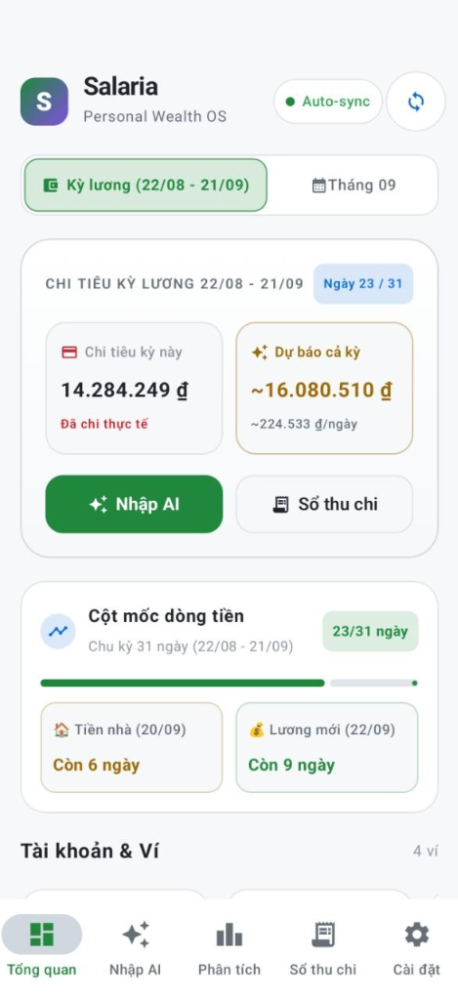
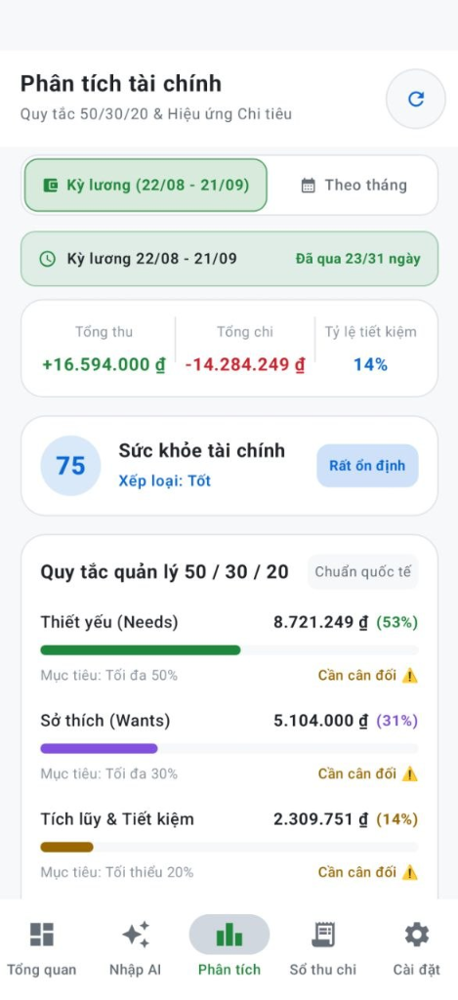
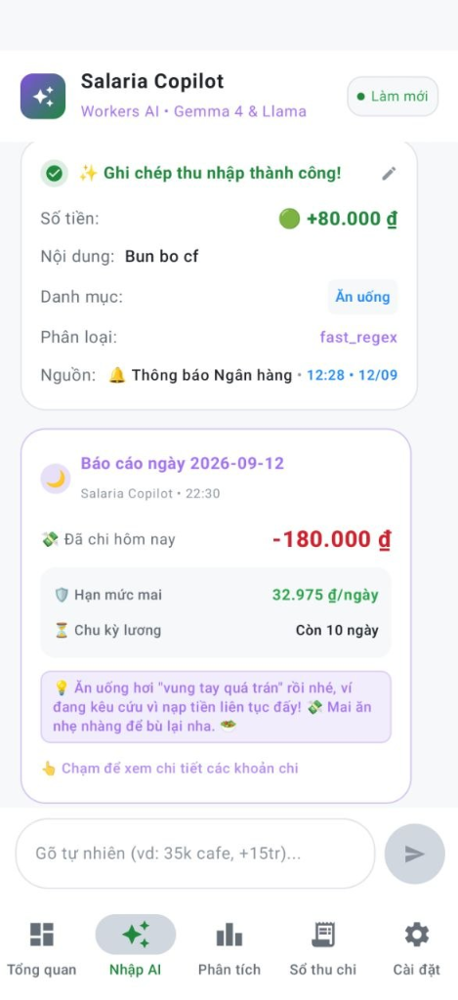
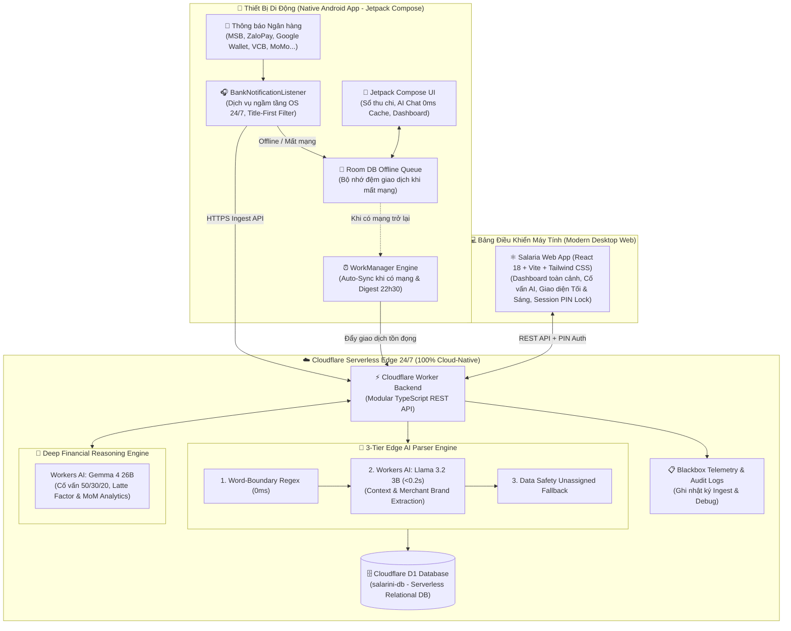

# 💎 Salaria

<p align="center">
  <b>🇻🇳 Tiếng Việt</b> &nbsp;|&nbsp; <a href="README_en.md">🇬🇧 English</a>
</p>

<p align="center">
  
  
  
  
  
</p>

> Trợ lý tài chính cá nhân tự động bắt biến động số dư ngân hàng và phân loại bằng AI theo thời gian thực — Giúp bạn luôn kiểm soát tốt ngân sách mà không cần tốn công ghi chép thủ công.

<p align="center">
  <br>
  <em>💻 Bảng điều khiển tài chính trung tâm (Modern Fintech Dashboard trên Desktop Web)</em>
</p>

| 📱 Dashboard Kỳ Lương | 📊 Phân Tích 50/30/20 | 🌙 Tổng Kết Tối 22h30 |
| :---: | :---: | :---: |
|  |  |  |
| *Dự báo chi tiêu & Cột mốc dòng tiền* | *Sức khỏe tài chính & 3 trụ cột* | *Hạn mức an toàn & Lời khuyên AI* |

---

## 🌟 Tính Năng Nổi Bật (Key Features)

### 1. 📱 Lắng Nghe Biến Động Số Dư Ngân Hàng 24/7 & AI Chat Logging
- **Real-Time Bank Notification Auto-Capture**: Tự động bắt biến động số dư tức thì 24/7 chạy ngầm tầng OS trực tiếp qua **Salaria Native Android App** (*MSB DigiBank, ZaloPay, Google Wallet, HSBC, Vietcombank, Techcombank, VPBank, TPBank, MoMo...*).
- **Title-First Smart Ingestion**: Cơ chế lọc tiền thông minh từ tiêu đề thông báo kết hợp bộ lọc tự động quét lại khi thông báo bị ẩn nội dung trên màn hình khóa.
- **Phân loại AI Đa Tầng (3-Tier Engine)**:
  - **Tầng 1 (0ms Word-Boundary Regex)**: Khớp từ khóa chuẩn từ danh mục với cơ chế chống va chạm từ con.
  - **Tầng 2 (Cloudflare Workers AI - Llama 3.2 3B)**: Bóc tách ngữ cảnh món ăn, quán xá, thương hiệu trên mạng GPU Edge siêu tốc (< 0.2s).
  - **Tầng 3 (Data Safety Fallback)**: Giữ trạng thái an toàn `Chưa phân loại` đối với các giao dịch mơ hồ hoặc chuyển khoản không rõ nội dung.
- **Zero-Latency In-App AI Chat**: Ghi chép thu chi siêu tốc bằng ngôn ngữ tự nhiên (`35k cafe`, `-45k cơm trưa`, `+15tr lương cty`, `rút 500k atm`). Phản hồi tức thì 0ms, hỗ trợ cử chỉ vuốt để trích dẫn giao dịch và lệnh hoàn tác nhanh `/undo`.

### 2. 📊 Bảng Điều Khiển Tài Chính Fintech 2026 (Modern Dashboard)
- **Financial Health Score Gauge (0 - 100)**: Vòng đo sức khỏe tài chính tính toán theo thời gian thực dựa trên tỷ lệ tích lũy và cấu trúc chi tiêu.
- **Daily Burn Rate & Month-End Projection**: Đo lường tốc độ "đốt tiền" trung bình mỗi ngày và dự báo tổng chi tiêu cuối tháng.
- **Safe Daily Spending**: Hạn mức chi tiêu an toàn còn lại mỗi ngày để đảm bảo hoàn thành mục tiêu tiết kiệm ≥ 20%.
- **Biểu đồ cột tương tác (Interactive Daily Spending)**: Tự động đổi màu theo mức độ chi (Xanh = Dưới TB, Cam = Vượt TB, Đỏ = Đột biến), tương tác trực tiếp để kiểm tra chi tiết từng ngày.
- **Đo lường Quy tắc 50/30/20 & Chu kỳ kỳ lương**: Theo dõi 3 trụ cột: *50% Thiết yếu (Needs)*, *30% Linh hoạt (Wants)*, *20% Tích lũy (Savings)* khớp theo ngày nhận lương thực tế mỗi tháng.

### 3. 🧠 Cố Vấn Tài Chính AI & Phân Tích Hiệu Ứng Latte (AI Advisor)
- Tự động phát hiện và cảnh báo các khoản chi nhỏ lẻ (`≤ 60.000₫`) tích tụ hàng tháng gây thất thoát dòng tiền (Hiệu ứng Latte).
- Cố vấn AI thông minh hỗ trợ giải đáp chiến lược ngân sách, gợi ý phương án cắt giảm chi phí và tính toán dòng tiền qua mô hình suy luận sâu **Cloudflare Workers AI (Gemma 4 26B)**.

<p align="center">
  <br>
  <em>🧠 Cố vấn tài chính AI & Phân tích chi tiêu vi mô (Hiệu ứng Latte)</em>
</p>

### 4. 📈 So Sánh Biến Động Đa Tháng & Báo Cáo Định Kỳ
- Theo dõi xu hướng tăng giảm thu chi và dòng tiền thặng dư giữa các tháng (MoM - Month over Month).
- Tự động gửi thông báo tổng kết chi tiêu mỗi tối lúc 22h30 giúp bạn nhìn lại bức tranh chi tiêu trong ngày.

<p align="center">
  <br>
  <em>📈 Báo cáo so sánh xu hướng thu chi đa tháng (Month-over-Month Analytics)</em>
</p>

### 5. 🔒 Bảo Mật Cá Nhân & Khóa Session PIN
- **Tự động khóa bảo vệ dữ liệu**: Tự động khóa bảo mật khi đóng tab trình duyệt hoặc rời ứng dụng, bảo vệ quyền riêng tư cho sổ tài chính cá nhân.
- **Xác thực mã PIN 6 số**: Tích hợp bàn phím số ảo bảo mật, thao tác nhanh gọn và an toàn.
- **Hỗ trợ Chế độ Tối & Sáng (Dark / Light Mode)**: Tùy biến hiển thị linh hoạt giữa chế độ Tối (Deep Navy dịu mắt) và chế độ Sáng (Clean Canvas phong cách GitHub).

---

## 🏗️ Kiến Trúc Hệ Thống (System Architecture)



---

## 📂 Cấu Trúc Thư Mục (Project Structure)

```text
salaria/
├── android/
│   ├── app/src/main/java/
│   └── build.gradle.kts
├── backend/
│   ├── migrations/
│   ├── src/
│   └── wrangler.jsonc
├── frontend/
│   ├── src/
│   └── vite.config.ts
├── docs/
│   ├── adr/
│   ├── architecture.md
│   ├── backlog.md
│   ├── feature-map.md
│   └── plans/
└── README.md
```

---

## 💬 Cú Pháp Ghi Chép Nhanh Bằng Ngôn Ngữ Tự Nhiên (Natural Language Logging)

Người dùng có thể nhập trực tiếp tại thanh nhập liệu **AI Chat** trên ứng dụng Android hoặc Web Dashboard:

| Nhu cầu ghi chép | Cú pháp ví dụ | Cơ chế phân loại & Kết quả |
|---|---|---|
| **Chi tiêu cơ bản** | `35k cafe` hoặc `45k com trua` | Tự động gán `-35.000₫` vào `[Ăn uống]` (0ms Regex) |
| **Thương hiệu / Địa điểm** | `180k Haidilao Landmark` | Llama 3.2 tự bóc tách `Haidilao` và gán vào `[Ăn uống]` (<0.2s) |
| **Ứng dụng / Dịch vụ** | `1200k ELSA Speak goi 1 nam` | Llama 3.2 nhận diện `ELSA Speak` và gán vào `[Học tập]` |
| **Chuyển tiền / Rút tiền** | `rút 500k atm` hoặc `chuyển 2tr cho vợ` | Tự nhận diện giao dịch luân chuyển giữa các ví (chuyển khoản), bảo toàn tổng số dư |
| **Thu nhập** | `+15tr luong cty` hoặc `500k thuong kpi` | Tự gán `+15.000.000₫` vào `[Thu nhập]` |
| **Hoàn tác siêu tốc** | `/undo` hoặc `/xoa` | Xóa ngay giao dịch vừa ghi nhận mà không cần mở sổ chi tiêu |

---

## 🚀 Hướng Dẫn Cài Đặt & Triển Khai (Quickstart Guide)

### 1. Yêu Cầu Môi Trường
- **Node.js**: Phiên bản 18 trở lên (`node -v`).
- **Android Studio / SDK**: Để biên dịch ứng dụng di động Android.
- **Tài khoản Cloudflare**: Sử dụng Cloudflare Workers, D1 Database và Workers AI miễn phí.

### 2. Triển Khai Cloudflare Worker & D1 Database
1. Mở Terminal tại thư mục `backend/`:
   ```bash
   cd backend
   npx wrangler login
   ```
2. Tạo cơ sở dữ liệu D1 phân tán trên Cloudflare Edge:
   ```bash
   npx wrangler d1 create salarini-db
   ```
3. Khởi tạo cấu trúc bảng dữ liệu:
   ```bash
   npx wrangler d1 execute salarini-db --remote --file=schema.sql
   npx wrangler d1 execute salarini-db --remote --file=migrations/0002_add_daily_summaries.sql
   ```
4. Cấu hình biến bí mật qua Cloudflare Secrets (Không lưu cứng trong Git):
   ```bash
   printf 'YOUR_API_KEY' | npx wrangler secret put API_KEY
   printf 'YOUR_MASTER_PIN' | npx wrangler secret put MASTER_PIN
   ```
5. Deploy Worker lên Cloudflare:
   ```bash
   npx wrangler deploy
   ```

### 3. Khởi Chạy Desktop Web App
Tại thư mục gốc dự án:
```bash
chmod +x start.sh
./start.sh
```
Trình duyệt sẽ tự động mở trang quản trị tại: **`http://localhost:5173`**

### 4. Cài Đặt Ứng Dụng Android Native
1. Mở dự án thư mục `android/` bằng Android Studio hoặc biên dịch file APK:
   ```bash
   cd android && ./gradlew assembleDebug
   ```
2. Cài đặt file APK lên thiết bị và cấp quyền **Notification Listener (Truy cập thông báo)** để ứng dụng tự động ghi nhận giao dịch 24/7 từ các ứng dụng ngân hàng.

---

## 🛠️ Công Nghệ Sử Dụng (Tech Stack)

- **Native Mobile App**: Android Native (Kotlin 2.0, Jetpack Compose, Room DB, WorkManager, NotificationListenerService).
- **Backend Edge**: Cloudflare Workers (Full-Stack TypeScript REST API, zero cold start).
- **Database**: Cloudflare D1 (Serverless SQLite phân tán toàn cầu).
- **Edge AI Models**:
  - Phân loại giao dịch: `@cf/meta/llama-3.2-3b-instruct`
  - Cố vấn tài chính sâu: `@cf/google/gemma-4-26b-a4b-it`
- **Desktop Web App**: React 18, Vite, TypeScript, Tailwind CSS, Recharts, Lucide Icons.

---

## 📄 Bản Quyền & Giấy Phép (License)

Dự án được phát hành dưới giấy phép mã nguồn mở Copyleft **[GNU General Public License v3.0 (GPLv3)](LICENSE)**.
