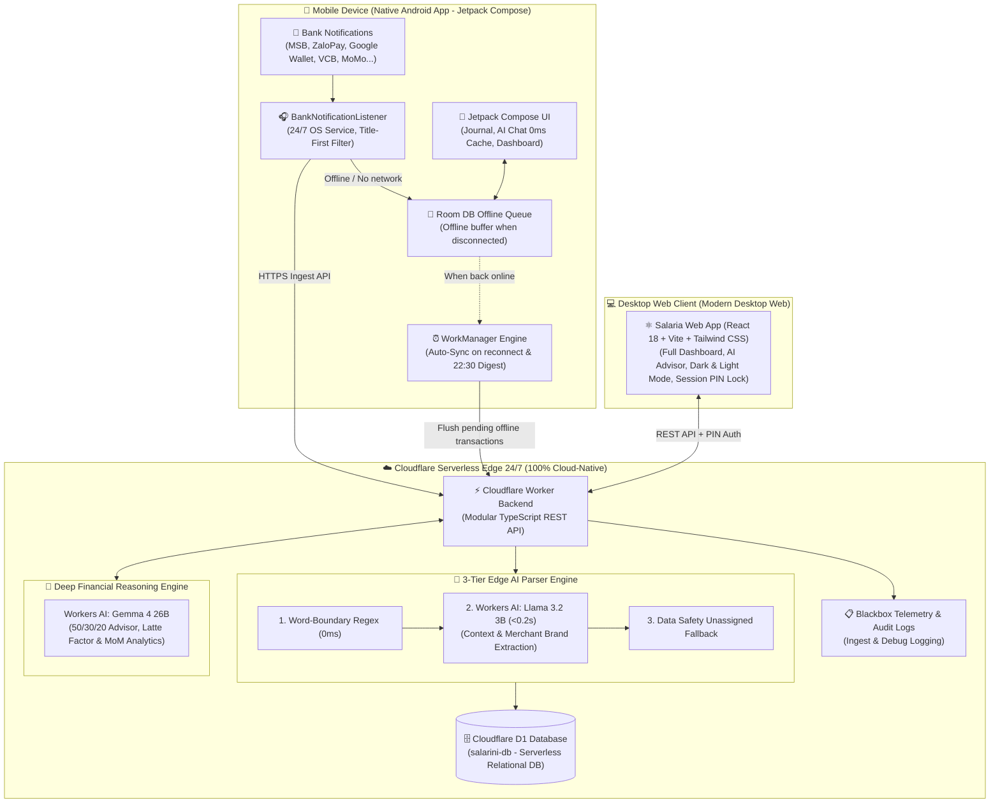

# 💎 Salaria

<p align="center">
  <a href="README.md">🇻🇳 Tiếng Việt</a> &nbsp;|&nbsp; <b>🇬🇧 English</b>
</p>

<p align="center">
  
  
  
  
  
</p>

> An automated personal finance companion that captures your bank alerts and categorizes them with AI in real time — keeping you on budget without the chore of manual logging.

<p align="center">
  <br>
  <em>💻 Central Financial Cockpit (Modern Fintech Dashboard on Desktop Web)</em>
</p>

| 📱 Paycheck Dashboard | 📊 50/30/20 Analytics | 🌙 22:30 Daily Digest |
| :---: | :---: | :---: |
|  |  |  |
| *Cycle Forecast & Cashflow Milestones* | *Financial Health & 3 Budget Pillars* | *Safe Spending Limit & AI Coaching* |

---

## 🌟 Key Features

### 1. 📱 24/7 Real-Time Bank Notification Auto-Capture & In-App AI Chat
- **Real-Time Bank Notification Auto-Capture**: Automatically captures balance fluctuations 24/7 running natively in the background on Android OS via the **Salaria Native Android App** (*MSB DigiBank, ZaloPay, Google Wallet, HSBC, Vietcombank, Techcombank, VPBank, TPBank, MoMo...*).
- **Title-First Smart Ingestion**: Intelligent amount extraction from notification titles combined with auto-rescan filtering when notifications are masked on the lock screen.
- **Multi-Tier AI Classification Engine (3-Tier Engine)**:
  - **Tier 1 (0ms Word-Boundary Regex)**: Matches verified standard keywords with sub-token anti-collision protection.
  - **Tier 2 (Cloudflare Workers AI - Llama 3.2 3B)**: Extracts merchant, cuisine, and brand context on GPU Edge in sub-second speeds (< 0.2s).
  - **Tier 3 (Data Safety Fallback)**: Safely assigns ambiguous or unclear transfers to `Uncategorized`.
- **Zero-Latency In-App AI Chat**: Log income and expenses at lightning speed via natural language (`35k coffee`, `-45k lunch`, `+15m salary`, `withdraw 500k atm`). Instant 0ms cached UI, swipe-to-quote transactions, and quick undo via `/undo`.

### 2. 📊 Modern Fintech Dashboard 2026
- **Financial Health Score Gauge (0 - 100)**: Real-time financial health score calculated dynamically based on savings rate and spending structure.
- **Daily Burn Rate & Month-End Projection**: Measures daily burn speed and accurately projects month-end spending.
- **Safe Daily Spending**: Computes the remaining safe-to-spend allowance each day to ensure your savings goal of ≥ 20% is preserved.
- **Interactive Daily Spending Bar Chart**: Dynamically colored by spending level (Green = Below Avg, Orange = Above Avg, Red = Spike), interactive inspection for each day.
- **50/30/20 Rule & Paycheck Cycle Tracking**: Tracks 3 core pillars: *50% Needs*, *30% Wants*, *20% Savings*, aligned with your actual monthly payday cycle.

### 3. 🧠 AI Financial Advisor & Latte Factor Analytics
- Automatically detects and alerts on micro-transactions (`≤ 60,000₫`) accumulating monthly into significant cash leakage (Latte Factor).
- Intelligent AI advisor answers budgeting questions, proposes cost-cutting strategies, and analyzes cash flow via deep reasoning powered by **Cloudflare Workers AI (Gemma 4 26B)**.

<p align="center">
  <br>
  <em>🧠 AI Financial Advisor & Micro-Expense Leakage Analysis (Latte Factor)</em>
</p>

### 4. 📈 Multi-Month Trend Comparison & Scheduled Reports
- Tracks income/expense trajectories and net savings across consecutive months (MoM - Month over Month).
- Automatically dispatches a daily spending digest every evening at 22:30 GMT+7 to review daily finances.

<p align="center">
  <br>
  <em>📈 Month-over-Month Multi-Cycle Financial Trends & Comparison</em>
</p>

### 5. 🔒 Privacy Protection & Session PIN Lock
- **Auto-Lock Privacy**: Automatically locks sensitive financial records when closing browser tabs or leaving the app.
- **6-Digit Session PIN**: Integrated on-screen secure numeric keypad, fast and safe.
- **Dark & Light Mode**: Seamless toggling between Dark Mode (Deep Navy Eye-Care) and Light Mode (GitHub Clean Canvas).

---

## 🏗️ System Architecture



---

## 📂 Project Structure

```text
salaria/
├── android/
│   ├── app/src/main/java/
│   └── build.gradle.kts
├── backend/
│   ├── migrations/
│   ├── src/
│   └── wrangler.jsonc
├── frontend/
│   ├── src/
│   └── vite.config.ts
├── docs/
│   ├── adr/
│   ├── architecture.md
│   ├── backlog.md
│   ├── feature-map.md
│   └── plans/
├── README_en.md
└── README.md
```

---

## 💬 Natural Language Logging Syntax

Users can type directly into the **AI Chat** bar on both the Android Native App and Desktop Web Dashboard:

| Expense Intent | Example Syntax | AI Mechanism & Result |
|---|---|---|
| **Daily Expense** | `35k cafe` or `45k com trua` | Automatically assigns `-35,000₫` to `[Dining]` (0ms Regex) |
| **Brand / Merchant** | `180k Haidilao Landmark` | Llama 3.2 extracts `Haidilao` and assigns to `[Dining]` (<0.2s) |
| **Apps / Subscriptions** | `1200k ELSA Speak 1 year` | Llama 3.2 identifies `ELSA Speak` and assigns to `[Education]` |
| **Transfer / ATM Withdrawal** | `withdraw 500k atm` or `transfer 2m to wife` | Identifies internal transfer between wallets, preserves total net worth |
| **Income** | `+15m company salary` or `500k kpi bonus` | Automatically assigns `+15,000,000₫` to `[Income]` |
| **Instant Undo** | `/undo` or `/xoa` | Instantly deletes the last logged entry without opening the journal |

---

## 🚀 Quickstart Guide

### 1. Prerequisites
- **Node.js**: v18 or higher (`node -v`).
- **Android Studio / SDK**: To compile the native Android application.
- **Cloudflare Account**: For Cloudflare Workers, D1 Database, and Workers AI.

### 2. Deploy Cloudflare Worker & D1 Database
1. Open terminal in `backend/`:
   ```bash
   cd backend
   npx wrangler login
   ```
2. Create D1 distributed SQLite database:
   ```bash
   npx wrangler d1 create salarini-db
   ```
3. Initialize database tables:
   ```bash
   npx wrangler d1 execute salarini-db --remote --file=schema.sql
   npx wrangler d1 execute salarini-db --remote --file=migrations/0002_add_daily_summaries.sql
   ```
4. Configure secrets via Cloudflare Secrets:
   ```bash
   printf 'YOUR_API_KEY' | npx wrangler secret put API_KEY
   printf 'YOUR_MASTER_PIN' | npx wrangler secret put MASTER_PIN
   ```
5. Deploy Worker to Cloudflare:
   ```bash
   npx wrangler deploy
   ```

### 3. Launch Desktop Web App
At the repository root:
```bash
chmod +x start.sh
./start.sh
```
Your browser will automatically open the management dashboard at: **`http://localhost:5173`**

### 4. Install Native Android Application
1. Open `android/` directory in Android Studio or compile APK via Gradle:
   ```bash
   cd android && ./gradlew assembleDebug
   ```
2. Install the generated APK on your device and grant **Notification Listener** permission to enable 24/7 automated bank balance tracking.

---

## 🛠️ Tech Stack

- **Native Mobile App**: Android Native (Kotlin 2.0, Jetpack Compose, Room DB, WorkManager, NotificationListenerService).
- **Backend Edge**: Cloudflare Workers (Full-Stack TypeScript REST API, zero cold start).
- **Database**: Cloudflare D1 (Serverless globally distributed SQLite).
- **Edge AI Models**:
  - Transaction Categorization: `@cf/meta/llama-3.2-3b-instruct`
  - Deep Financial Reasoning: `@cf/google/gemma-4-26b-a4b-it`
- **Desktop Web App**: React 18, Vite, TypeScript, Tailwind CSS, Recharts, Lucide Icons.

---

## 📄 License

This project is licensed under the **[GNU General Public License v3.0 (GPLv3)](LICENSE)**.
