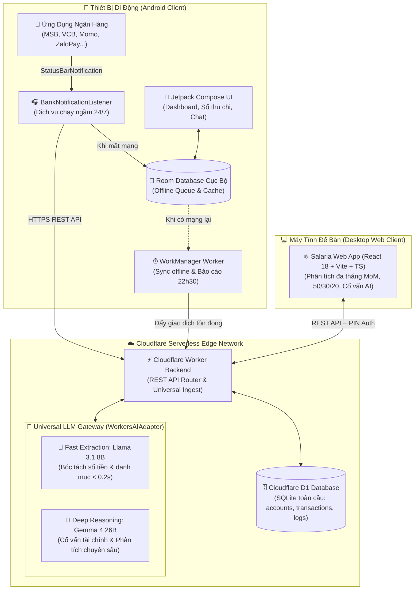
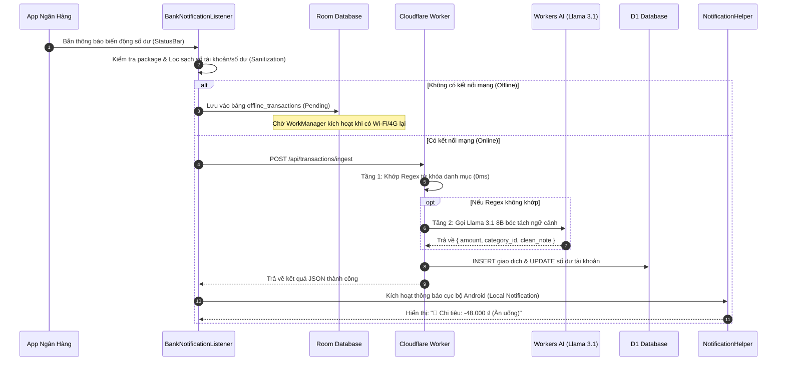
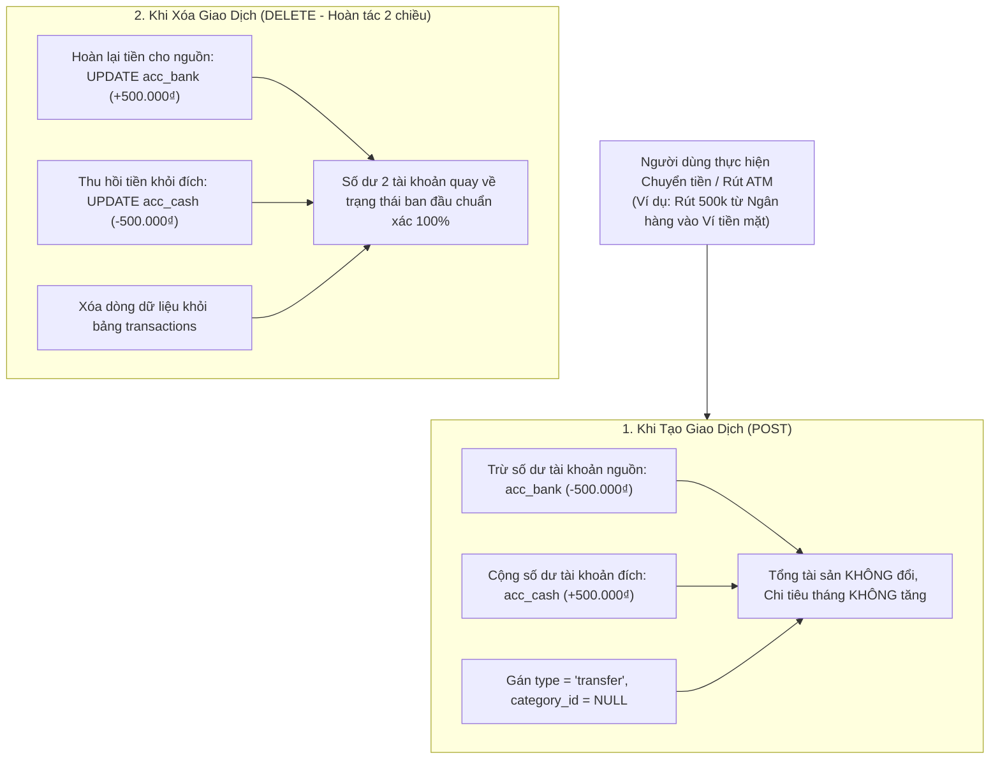

# 🏛️ Salaria — System Architecture & Data Flow

Tài liệu này mô tả chi tiết kiến trúc kỹ thuật và các luồng dữ liệu (Data Flows) trong hệ sinh thái quản lý tài chính **Salaria**.

---

## 1. Sơ Đồ Tổng Quan Hệ Thống (High-Level Architecture)



---

## 2. Luồng Bóc Tách Thông Báo & Đồng Bộ Ngoại Tuyến (Ingestion & Sync Flow)

Luồng này bảo đảm **không bao giờ thất thoát giao dịch** ngay cả khi điện thoại không có kết nối Internet:



---

## 3. Luồng Tính Toàn Vẹn Số Dư Khi Chuyển Tiền & Rút ATM (Balance Integrity Flow)

Quy tắc bất biến: **Chuyển tiền nội bộ (Transfer) hoặc Rút tiền ATM tuyệt đối KHÔNG tính vào chi tiêu sinh hoạt tháng (Tránh bẫy Double Counting)**.



---

## 4. Kênh Dự Phòng An Toàn (Safety Fallback Channel)

* **Telegram Bot**: Duy trì hoạt động độc lập 24/7 trên Cloudflare Worker làm kênh ghi chép dự phòng và kênh cứu hộ (/undo).
* **MacroDroid**: Đã chính thức được loại bỏ hoàn toàn khỏi kiến trúc và thay thế bởi ứng dụng Native Android (`BankNotificationListener.kt`).
* Nếu người dùng có nhu cầu chuyển máy hoặc app Android tạm dừng, luồng Telegram Bot vẫn sẵn sàng phục vụ 24/7.

---

## 5. Bản Đồ Cấu Trúc Mã Nguồn (Master Project & Component Map)

```text
Salaria/ (Repository: Salarini)
├── 📱 android/                   # Ứng dụng Di động Native (Kotlin + Jetpack Compose)
│   ├── app/src/main/java/com/salaria/app/
│   │   ├── data/api/             # Retrofit REST Client (SalariaApi.kt, ApiClient.kt)
│   │   ├── data/local/           # Room DB ngoại tuyến (AppDatabase.kt) & PreferencesManager.kt
│   │   ├── data/model/           # Models, DTOs & ChatManager.kt (Bộ nhớ đệm phiên 0ms cho Chat)
│   │   ├── service/              # BankNotificationListener.kt (Bắt noti 24/7) & NotificationHelper.kt
│   │   ├── ui/screens/           # Compose Screens (ChatScreen, TransactionsScreen, DashboardScreen...)
│   │   ├── ui/components/        # Popup chỉnh sửa (EditTransactionBottomSheet.kt), Khóa PIN...
│   │   └── worker/               # WorkManager chạy ngầm (SyncOfflineTransactionsWorker & DailySummaryWorker)
│   └── Salaria.apk               # Bộ cài đặt APK hoàn thiện (18.8 MB)
│
├── ☁️ backend/                   # Cloudflare Serverless Edge Backend (TypeScript Modular)
│   ├── src/
│   │   ├── index.ts              # Router trung tâm, Middleware xác thực Master PIN & CORS
│   │   ├── routes/               # Modular Endpoints tách biệt:
│   │   │   ├── ingest.ts         # Tiếp nhận noti ngân hàng, Chat AI & Command Interceptor (/undo, quote)
│   │   │   ├── transactions.ts   # CRUD giao dịch & Toàn vẹn số dư transfer
│   │   │   ├── accounts.ts       # Quản lý ví/ngân hàng & số dư
│   │   │   ├── analytics.ts      # Phân tích 50/30/20, Latte Factor & So sánh đa tháng MoM
│   │   │   ├── categories.ts     # Danh mục chi tiêu & icon
│   │   │   ├── backup.ts         # Xuất/nhập dữ liệu D1
│   │   │   ├── logs.ts           # Hệ thống hộp đen Telemetry
│   │   │   └── telegram_webhook.ts # Kênh dự phòng Telegram Bot an toàn
│   │   ├── ai/workers_ai.ts      # Gateway LLM (Universal WorkersAIAdapter: Llama 3.1 & Gemma 4)
│   │   ├── db/index.ts           # D1 Database client wrapper
│   │   ├── services/             # Bộ phân loại regex (parser.ts), kỳ lương (paycheck.ts), Telegram bot
│   │   └── types.ts              # Type-safe contract chung giữa Backend, Android và Web
│   ├── migrations/               # D1 Database Migrations (0001_initial_schema.sql)
│   ├── schema.sql                # Bản tra cứu nhanh cấu trúc SQLite
│   └── wrangler.jsonc            # Cấu hình Cloudflare Worker, AI model & D1 bindings
│
├── 💻 frontend/                  # Ứng dụng Quản trị Web Desktop (React 18 + Vite + TS + Tailwind)
│   ├── src/
│   │   ├── api/client.ts         # Axios client tích hợp mã PIN phiên làm việc
│   │   ├── pages/                # DashboardPage, AiAdvisorPage, MultiMonthComparePage, AccountsPage
│   │   ├── context/ThemeContext  # Quản lý 2 Theme: Tối gốc (Ocean) & Sáng (GitHub Light)
│   │   └── components/           # Sidebar, Navbar, ThemeSelector, PinLockScreen
│   └── wrangler.jsonc            # Cấu hình triển khai Cloudflare Assets/Pages
│
├── 📚 docs/                      # Tài liệu Kỹ thuật & Quản trị Dự án
│   ├── adr/                      # Bản ghi quyết định kiến trúc (ADR 0001 - 0006)
│   ├── plans/                    # Kế hoạch thực thi chi tiết của từng Phase (1 - 5)
│   ├── architecture.md           # Sơ đồ kiến trúc tổng thể, luồng dữ liệu & toàn vẹn số dư
│   ├── backlog.md                # Lộ trình sản phẩm & trạng thái hoàn thành các tính năng (P0 - P3)
│   └── retro.md                  # Đánh giá sau các đợt phát hành & bài học kinh nghiệm
│
├── 🧭 GEMINI.md                  # Hiến pháp tối cao & Hướng dẫn dành cho AI Agent
├── 📖 README.md                  # Giới thiệu tổng quan & hướng dẫn khởi chạy dự án
└── 🚀 start.sh                   # Script khởi động nhanh Web Dashboard cục bộ (port 5173)
```

