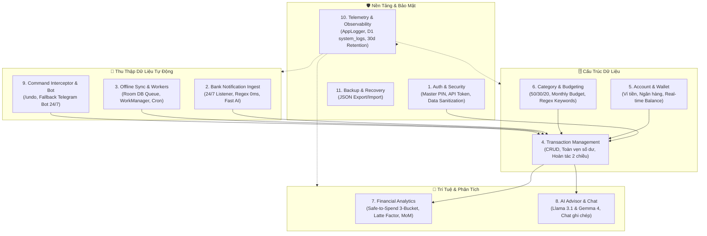

# 🗺️ Salaria — Master Feature Map & Capability Architecture

Tài liệu này tổng hợp Bản đồ Tính năng (Feature Map) toàn diện của hệ sinh thái quản lý tài chính **Salaria** (Repository: `Salarini`), thiết lập theo phương pháp chuẩn **Glass & Feature Map** (Lauren Tan shape) tại thư mục `.agents/skills/verify-salaria/references/features/`.

---

## 🧭 1. Nguyên Tắc Cốt Lõi: The Iron Law

```
NO DIAGNOSIS OR FIX WITHOUT LOCATING THE DEFECT ON THE FEATURE MAP FIRST
```

Mọi phát hiện lỗi, điều chỉnh mã nguồn hoặc mở rộng tính năng phải luôn định vị chính xác khu vực bị ảnh hưởng trên Bản đồ Tính năng trước khi can thiệp vào mã nguồn.

---

## 🗂️ 2. Bản Đồ 11 Cụm Tính Năng (Feature Areas Map)

Toàn bộ hệ thống Salaria được phân rã thành 11 cụm tính năng độc lập, khép kín và có ranh giới rõ ràng:



---

## 📚 3. Danh Mục Chi Tiết & Đường Dẫn Hồ Sơ Đặc Tả

| STT | Khu Vực Tính Năng | File Đặc Tả Chi Tiết | Trọng Yếu | Mô Tả Tóm Tắt |
| :---: | :--- | :--- | :---: | :--- |
| **01** | **Bảo Mật & Xác Thực** | [auth-and-security.md](file:///home/dynav/Documents/antigravity/Salarini/.agents/skills/verify-salaria/references/features/auth-and-security.md) | P0 | Xác thực Master PIN trên Web, Header Key API, che giấu số tài khoản nhạy cảm |
| **02** | **Bóc Tách Noti Ngân Hàng** | [bank-notification-ingest.md](file:///home/dynav/Documents/antigravity/Salarini/.agents/skills/verify-salaria/references/features/bank-notification-ingest.md) | P0 | Dịch vụ Android bắt thông báo 24/7, lọc rác OTP, phân loại Regex 0ms & Fast AI |
| **03** | **Đồng Bộ Offline & Workers** | [offline-sync-and-workers.md](file:///home/dynav/Documents/antigravity/Salarini/.agents/skills/verify-salaria/references/features/offline-sync-and-workers.md) | P0 | Room DB phòng thủ mất mạng, Android WorkManager tự sync khi có mạng, báo cáo 22h30 |
| **04** | **Quản Lý Giao Dịch** | [transaction-management.md](file:///home/dynav/Documents/antigravity/Salarini/.agents/skills/verify-salaria/references/features/transaction-management.md) | P0 | CRUD giao dịch, bảo toàn số dư Transfer/ATM, hoàn tác 2 chiều chính xác |
| **05** | **Tài Khoản & Ví Tiền** | [account-and-wallet.md](file:///home/dynav/Documents/antigravity/Salarini/.agents/skills/verify-salaria/references/features/account-and-wallet.md) | P0 | Quản lý tiền mặt/ngân hàng/tiết kiệm, tính số dư thời gian thực từ giao dịch |
| **06** | **Danh Mục & Ngân Sách** | [category-and-budgeting.md](file:///home/dynav/Documents/antigravity/Salarini/.agents/skills/verify-salaria/references/features/category-and-budgeting.md) | P1 | Phân bổ 50/30/20 (Needs, Wants, Savings), định mức ngân sách tháng, từ khóa regex |
| **07** | **Phân Tích Dòng Tiền** | [financial-analytics-and-insights.md](file:///home/dynav/Documents/antigravity/Salarini/.agents/skills/verify-salaria/references/features/financial-analytics-and-insights.md) | P1 | Safe-to-Spend 3-Bucket theo chu kỳ lương, Latte Factor, so sánh đa tháng MoM |
| **08** | **Cố Vấn & Chat AI** | [ai-advisor-and-chat.md](file:///home/dynav/Documents/antigravity/Salarini/.agents/skills/verify-salaria/references/features/ai-advisor-and-chat.md) | P1 | Workers AI Gateway (Llama 3.1 & Gemma 4), Chat ghi chép tiếng Việt, trích dẫn |
| **09** | **Lệnh Nhanh & Bot** | [command-interceptor-and-bot.md](file:///home/dynav/Documents/antigravity/Salarini/.agents/skills/verify-salaria/references/features/command-interceptor-and-bot.md) | P1 | Đánh chặn `/undo`, `/xoa`, Telegram Bot 24/7 kênh cứu trợ khẩn cấp |
| **10** | **Hộp Đen Telemetry** | [telemetry-and-observability.md](file:///home/dynav/Documents/antigravity/Salarini/.agents/skills/verify-salaria/references/features/telemetry-and-observability.md) | P2 | AppLogger viễn thám, bảng D1 `system_logs`, tự động dọn dẹp log sau 30 ngày |
| **11** | **Sao Lưu & Khôi Phục** | [backup-and-recovery.md](file:///home/dynav/Documents/antigravity/Salarini/.agents/skills/verify-salaria/references/features/backup-and-recovery.md) | P1 | Xuất toàn bộ CSDL ra JSON độc lập và nhập khôi phục an toàn |

---

## 🛠️ 4. Hướng Dẫn Sử Dụng Trong Điều Tra Lỗi (Bug Triage Workflow)

Khi gặp bất kỳ sự cố nào trong dự án Salaria, áp dụng quy trình 4 bước:

1. **Tra cứu Map**: Mở file `.md` tương ứng trong `.agents/skills/verify-salaria/references/features/`.
2. **Xác định Chuỗi Thành Phần (Component Chain)**:
   - `Entry / Route` -> `Controller / View` -> `Service / Logic` -> `Schema / Model`.
3. **Phân biệt Triệu chứng & Nguyên nhân**:
   - *Symptom Site*: Nơi báo lỗi (ví dụ: màn hình văng hoặc ném exception).
   - *Fault Origin*: Điểm gốc rễ dữ liệu không hợp lệ được phát sinh.
4. **Trình bày Chẩn đoán & Thảo luận**: Trình bày rõ ràng nguyên nhân gốc rễ và đề xuất phương án cho người dùng trước khi can thiệp mã nguồn.
